# Understanding the Repo
For each part, there is a separate folder in the repo. While running the commands below, it is assumed that they are being run in their respective directories.

# 1. Problem and Dataset
Suppose we are to analyze the liquor consumption in all the counties of the state Iowa in USA. This information, for example might help the law enforcement agencies to address regions with alcohol-related crimes or even help the marketing agencies to campaign in regions with higher sales or let the manufacturers know how well their product performs in an area etc.

The dataset explored here contains the information of sales at stores throughout the Iowa state from January 2021 to January 2022. It has been taken from [kaggle](https://www.kaggle.com/gabrielramos87/iowa-sales-liquor-jan-2021jan-2022), who themselves have adapted from [data.iowa.gov/](https://data.iowa.gov/Sales-Distribution/Iowa-Liquor-Sales/m3tr-qhgy).

The data is in a CSV format. The compressed size is ~135MB and the uncompressed has a size of ~680MB. For the details of all the columns, see the [description](description.md).

In order to obtain the dataset, login to kaggle and download from [this page](https://www.kaggle.com/gabrielramos87/iowa-sales-liquor-jan-2021jan-2022). You may use the Kaggle API for this as well. After extracting, rename the file `Iowa Liquor Sales (Jan 2021-Jan 2022).csv` to `sales.csv`.

To make the data more usable for this project, it has been split into months (separately), with the assumption that each file corresponds to a particular month and is created every month on a specific date by the data collection team. The file used to do this is present [here](./p1_dataset/data_preprocess.ipynb). Running this file produces CSV files that will be used by the subsequent steps.


# 2. Cloud and IaC
(rubric: The project is developed on the clound and IaC tools are used)


## Setting up GCP

Authenticate to GCP. This assumes that the Google Cloud SDK is installed and you have created a user with the necessary permissions for this project.  
```bash
gcloud auth application-default login
```

## Infrastructure Provisioning using Terraform
By using Terraform, we will
- create a bucket in GCS (the datalake) called `dtc_project_dtc-de-01`
- create a table in BigQuery (the data warehouse) called `iowa_liquor`


1) Initialize Terraform
This step will create some additional files.
```bash
terraform init
```

2) Plan your infrastructure.
This will output what resources will be created (but won't create them) based on your `*.tf` files.
```bash
terraform plan
```

3) Apply your changes.
This will create the resources as shown in the plan phase.
```bash
terraform apply
```

4) Once you are done with the project, execute the following line to delete the resources created above.
```bash
terraform destroy
```


## Before Running this Step
### GCS
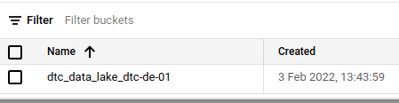

### BQ
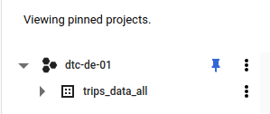

## After Running this Step
### GCS
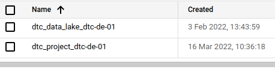

### BQ
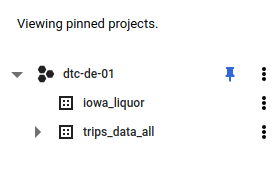


# 3. Data Ingestion - Airflow
(rubric: End-to-end pipeline: multiple steps in the DAG, uploading data to data lake)

There are 13 files corresponding to each month of Jan 21 - Jan 22. We will create a DAG that downloads each CSV file, converts them to parquet format which is compressed and can make transfers faster, and then uploads them to the datalake (which is GCS in our case). Note that the datalake is an unstructured storage destination where the contents may be of different nature (like text, images, etc.)

The DAG has four tasks
- download_dataset_task: this downloads the CSV file from the sever to the local folder
- format_to_parquet_task: This converts the CSV file to the parquet format
- local_to_gcs_task: This uploads our parquet file to the datalake
- delete_dataset_task: This task deletes the (downloaded) CSVs and the (converted) parquet files.

These tasks are run at the second day of every month from Jan 2021 to Jan 2022, and is defined via the `schedule_interval` argument.

In the real-world, these files will be hosted on a webserver; for our purpose, we will create our own server by running `python3 -m http.server`. This will allow the use `curl` to fetch files from this folder in our Airflow DAGs using the URL `{your_ip}:8000` inside your DAG. 

The Airflow docker setup was used was the one presented in the (not so) optional video '[Lightweight Local Setup for Airflow](https://www.youtube.com/watch?v=A1p5LQ0zzaQ&list=PL3MmuxUbc_hJed7dXYoJw8DoCuVHhGEQb&index=21)'.  To run the the DAGs, we build the docker image first and then execute it.

```bash
docker-compose build
docker-compose up airflow-init
docker-compose up
```

To run the DAG (monthly), we have to pass argument to airflow **inside one of the running containers**. First, we find the running container.

```bash
docker ps # look for *airflow-webserver
docker exec -it 10a4d8854a45 bash
airflow dags backfill data_ingest_gcs_liq_dag --reset-dagruns -s 2021-01-01 -e 2022-01-31
```

## Before Running this Step
## Airflow
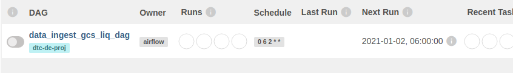
### GCS
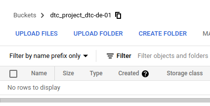

## After Running this Step
### Airflow
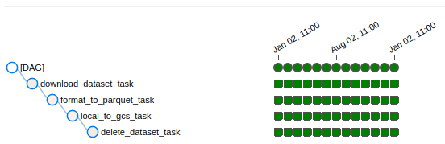

### GCS
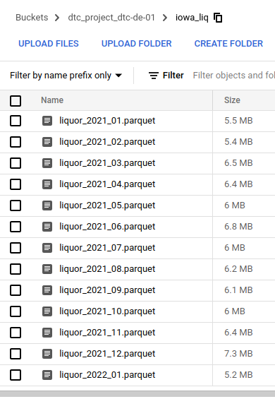

# 4. Data warehouse - GCP
(rubric: Tables are partitioned and clustered in a way that makes sense for the upstream queries)

We have already uploaded our data to GCS (datalake). Now we will it move it to our data warehouse (BigQuery). As a reminder, a data warehouse is a structured storage destination.

There are two tasks:
- bigquery_external_table_task: First we will create an external table. This does not actually store the data, but references it from the datalake. 
- bq_create_part_clust_table_job: Then, we will create a local table which is also partitioned by date and clustered by county . 


## Before Running this Step


## After Running this Step
### DAG Run
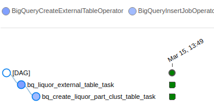

### BigQuery
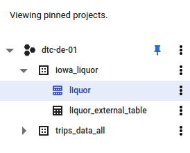

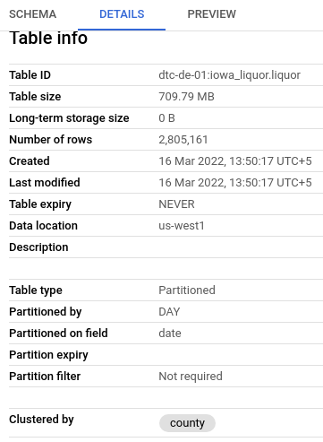

# 5. Transformations - dbt
- date

## Setup
To run dbt, we will use docker (linked to our Google BigQuery). This is slightly different from the official setup. The instructions can be found [here](https://github.com/ankurchavda/data-engineering-zoomcamp/blob/main/4_dbt/docker-setup.md). This is reproduced below.

Copy the `profiles.yml` file inside `~./dbt/`

To run
```
docker-compose build
docker-compose run dbt-de-zoomcamp init
```

This will be followed by a series of inputs that are specified below along with the answers

```
What is the desired project name?: iowa_liq
Which database would you like to use?
[1] bigquery

(Don't see the one you want? https://docs.getdbt.com/docs/available-adapters)

Enter a number: 1
[1] oauth
[2] service_account
Desired authentication method option (enter a number): 2
keyfile (/path/to/bigquery/keyfile.json): /.google/credentials/google_credentials.json
project (GCP project id): dtc-de-01         
dataset (the name of your dbt dataset): iowa_liquor
threads (1 or more): 4
timeout_seconds [300]: 300
[1] US
[2] EU
Desired location option (enter a number): 1
13:34:32  Profile iowa_liq written to /root/.dbt/profiles.yml using target's profile_template.yml and your supplied values. Run 'dbt debug' to validate the connection.
13:34:32  
Your new dbt project "iowa_liq" was created!
```

You have to manually edit the location from `US` to `us-west1` in `~/.dbt/profiles.yml`

[All changes inside the dbt folder require sudo privileges]
Inside the working directory, edit the file `./dbt/iowa_liq/dbt_project.yml`  to replace the profile from `iowa_liq` to `de-dbt-bq`. Or you can replace it with the file in this repo. 

To verify that everything works, run this command
```
docker-compose run --workdir="//usr/app/dbt/iowa_liq" dbt-de-zoomcamp debug
```

If everything works, it will say `All checks passed!`. Congratulations!

## Models
 Once the steps complete, place the `models` folder in this repo with the one inside the `dbt/iowa_liq` folder (delete the examples folder!)

Here, we read data from the data warehouse to create our final table. While reading, we ensure that all values have the correct datatypes (via the `cast` method in SQL). This table is named as `dbt_iowa_liq` (the name of the model inside our core stage. 

To run all the models, execute the following command
```
docker-compose run \
  --workdir="//usr/app/dbt/iowa_liq" \
  dbt-de-zoomcamp \
  build 
```

After running this, you will see the output `Done. PASS=1 WARN=0 ERROR=0 SKIP=0 TOTAL=1`.


To see the documentation,

```
docker-compose run \
  --workdir="//usr/app/dbt/iowa_liq" \
  dbt-de-zoomcamp \
  docs generate
  
docker-compose run \
  --workdir="//usr/app/dbt/iowa_liq" \
  dbt-de-zoomcamp \
  docs serve
```

## Before Running this Step


## After Running this Step
### BigQuery
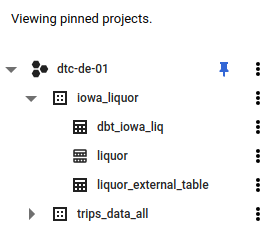
Note that the datatypes have been fixed. For example in our original table `liquor` create in part 4, the `vendor_number` is FLOAT, whereas in `dbt_iowa_liq`, it has been casted to integer.
### DBT Docs
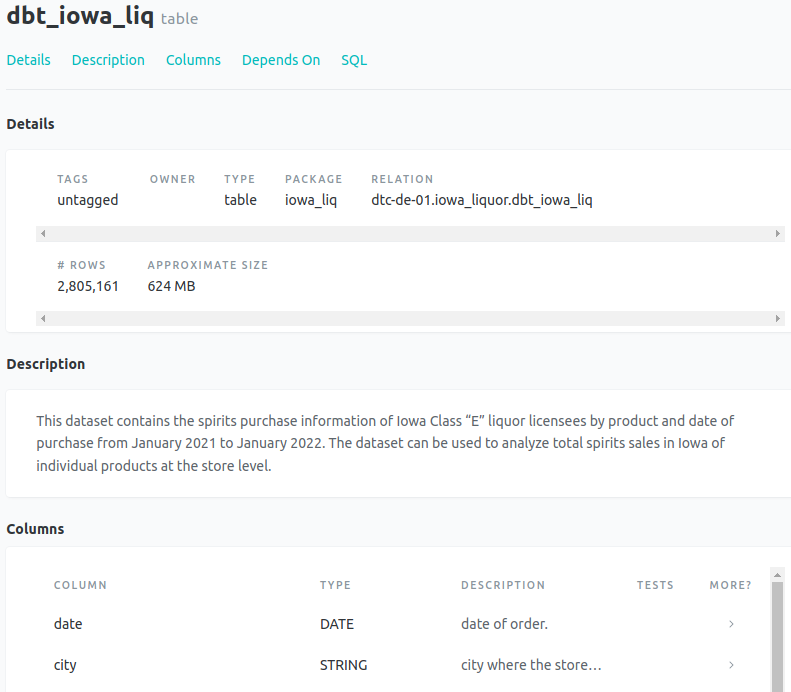


# 6. Dashboard
(rubric: A dashboard with 2 tiles)
- top 10 selling brands
- top 10 selling counties
- sales by season (pi chart or bar chart)

Here, we read from our table called `dbt_iowa_liq` inside Google Data Studio to create dashboards. This is supposed to be a presentable form of the data for managers, decision makers, and other stakeholders.

Got to [Google Data Studio](https://datastudio.google.com/). Select `Create` -> `Data Source` -> `BigQuery` -> `dtc-de` -> `iowa_liquor` -> `dbt_iowa_liq`. Select `Connect` in the top right.

Change all `Default Aggregation` to `None` and select `Create Report`. 


Add a Date Range Control, since we will only display data for the year 2021.

Add a few charts like numeric, time-series, and pie-chart.

Also, add a field using the bottom right. Type `quarter` as the name and `QUARTER(Date)` as the formula. We will see that the last quarter (Sep-Dec) has the most sales (and probably consumption too)

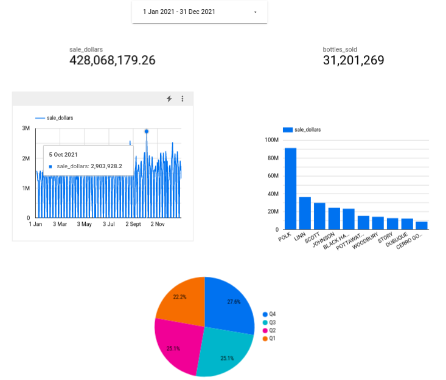

The report can be viewed [here](./p6_gds/DTC-DE-Project.pdf)